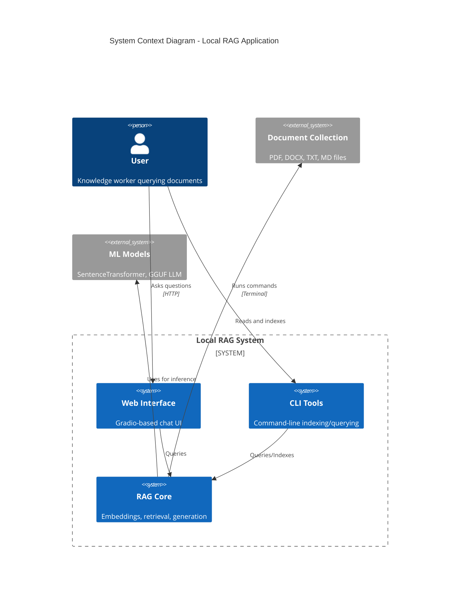
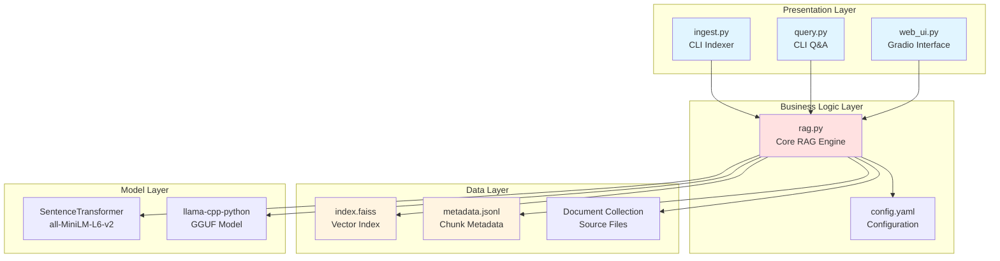
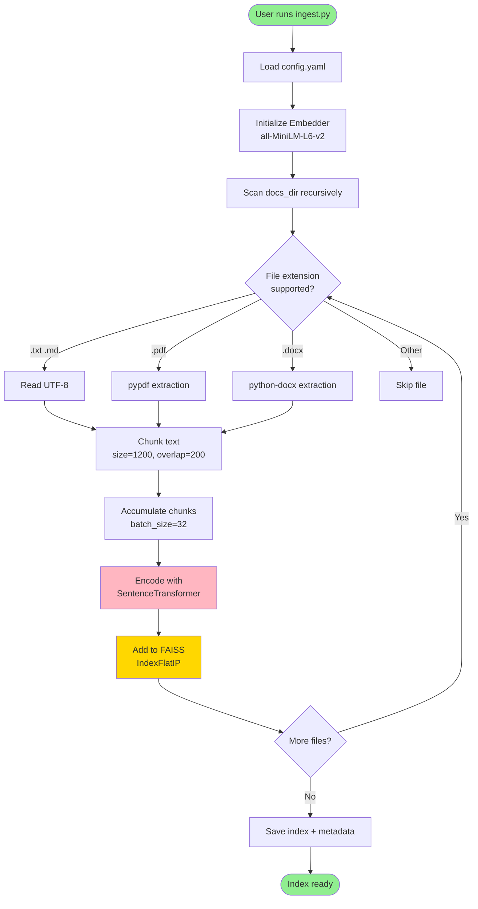
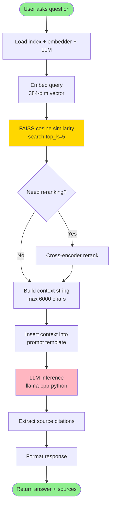
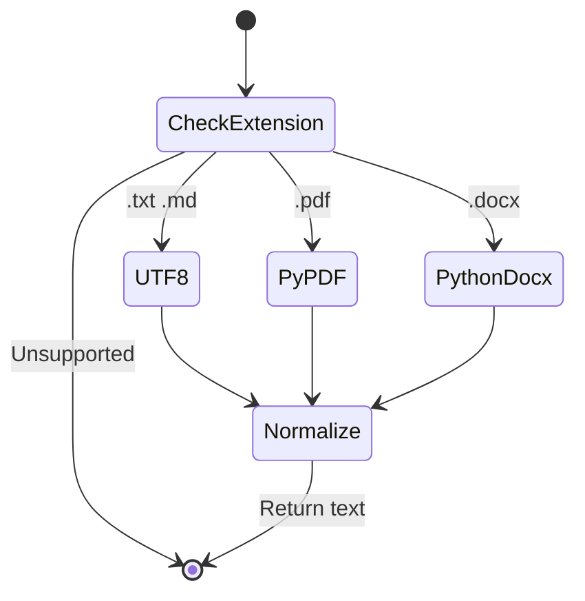
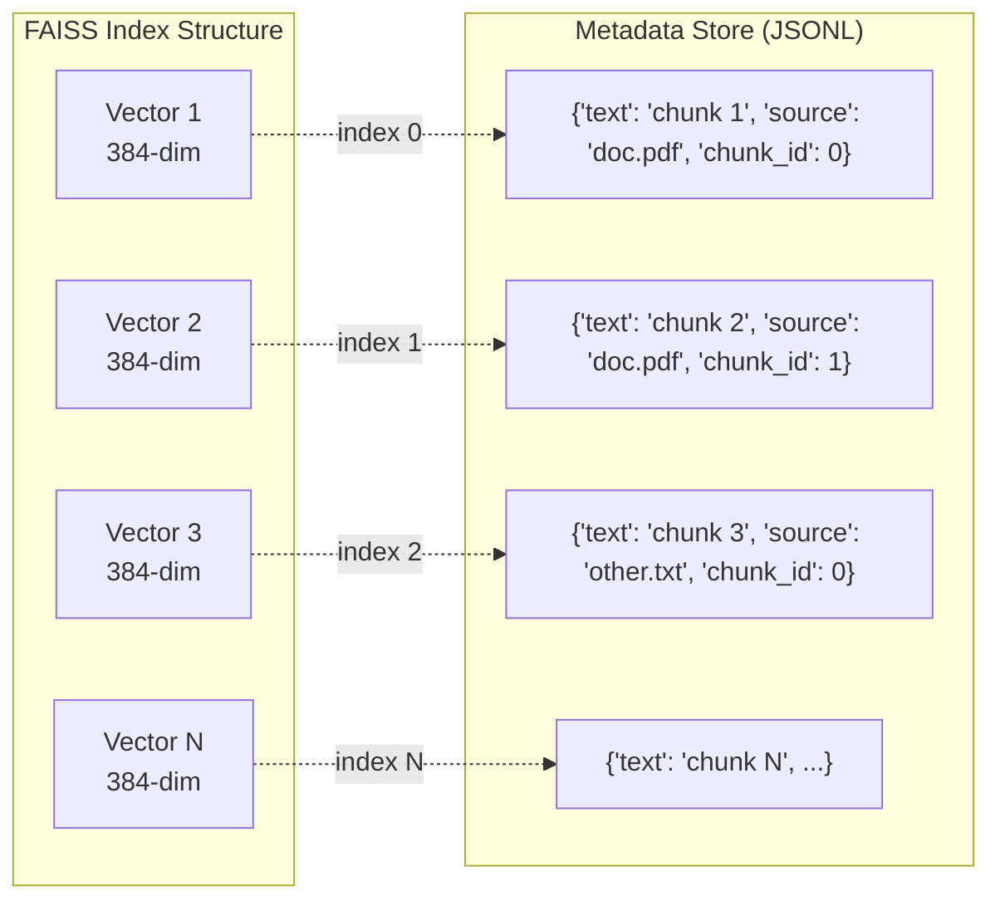
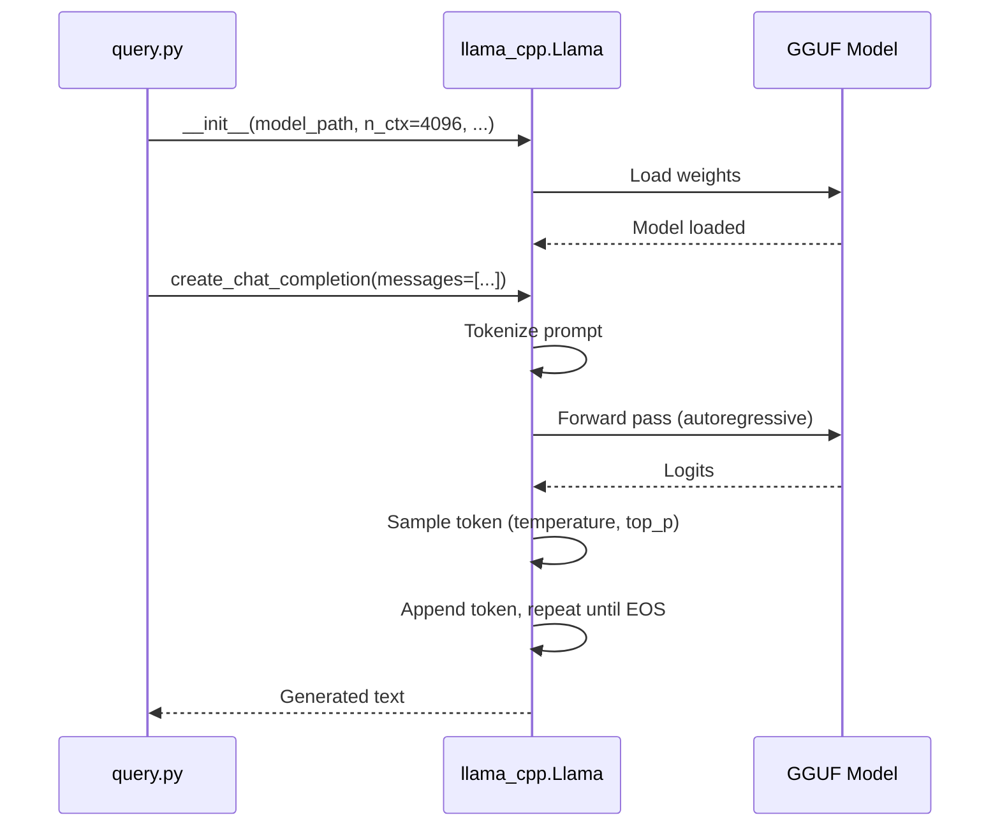
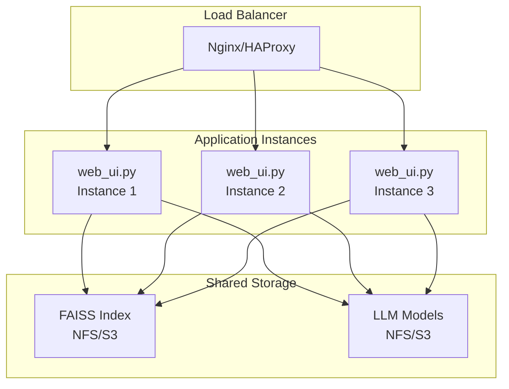

# Local RAG - System Architecture

## High-Level Architecture

This document provides detailed architectural documentation for the Local RAG system, including component interactions, data flows, and design decisions.

---

## System Overview



---

## Component Architecture

### Layer Separation



---

## Data Flow Diagrams

### Indexing Flow (Offline)



### Query Flow (Online)



---

## Component Details

### 1. Document Loader (rag.py::read_file_auto)

**Responsibility:** Extract text from various file formats



**Error Handling:**
- File not found → Returns empty string
- Parse failure → Returns empty string (logged)
- Encoding errors → Tries utf-8, then latin-1 fallback

---

### 2. Text Chunker (rag.py::chunk_text)

**Algorithm:** Sentence-aware sliding window

```
Input: "Sentence one. Sentence two. Sentence three. Sentence four."
chunk_size=30, overlap=10

Step 1: Split into sentences
  ["Sentence one.", "Sentence two.", "Sentence three.", "Sentence four."]

Step 2: Accumulate to chunk_size
  Chunk 0: "Sentence one. Sentence two." (28 chars)
  
Step 3: Add overlap from previous chunk (last 10 chars)
  Chunk 1: "nce two. Sentence three." (but adjusted to sentence boundary)
  Chunk 1: "Sentence two. Sentence three." (30 chars)
  
Step 4: Continue...
  Chunk 2: "Sentence three. Sentence four." (31 chars)
```

**Key Properties:**
- Preserves sentence boundaries (no mid-sentence splits)
- Overlap ensures context continuity
- Handles edge cases (very long sentences, very short documents)

---

### 3. Embedder (rag.py::Embedder)

**Model Architecture:** all-MiniLM-L6-v2
- **Type:** Sentence-BERT (bi-encoder)
- **Layers:** 6-layer MiniLM
- **Output:** 384-dimensional dense vectors
- **Training:** Trained on 1B+ sentence pairs (SNLI, MultiNLI, etc.)
- **Normalization:** L2-normalized (enables cosine similarity via dot product)

**Usage Pattern:**
```python
embedder = Embedder("all-MiniLM-L6-v2")
vectors = embedder.encode(["text1", "text2", "text3"])
# vectors.shape = (3, 384)
```

**Batch Processing:**
- Internal batching in SentenceTransformer (batch_size=32 default)
- Automatic device selection (CUDA if available, else CPU)

---

### 4. FAISS Vector Store (rag.py::FaissStore)

**Index Type:** IndexFlatIP (Inner Product for cosine similarity)



**Search Algorithm:**
1. Normalize query vector (L2 norm)
2. Compute dot products with all index vectors (brute-force)
3. Return top-k indices with highest scores
4. Look up metadata by index

**Complexity:**
- Indexing: O(n) where n = number of vectors
- Search: O(n·d) where d = dimension (384)
- For large datasets (>100k vectors), consider IndexIVFFlat or IndexHNSW

---

### 5. LLM Inference (llama-cpp-python)

**Model Format:** GGUF (GPT-Generated Unified Format)
- Successor to GGML
- Supports quantization (Q4_K_M = 4-bit quantization, K-means optimization)
- Platform-agnostic (CPU, CUDA, Metal, OpenCL)

**Inference Pipeline:**



**Sampling Parameters:**
- **temperature**: Controls randomness (0 = deterministic, 1 = maximum randomness)
- **top_p**: Nucleus sampling (cumulative probability threshold)
- **repeat_penalty**: Penalizes repeated tokens (1.0 = no penalty, 1.1 = slight penalty)

---

## Design Decisions

### Why FAISS IndexFlatIP?
**Pros:**
- Exact k-NN search (no approximation)
- Simple, no tuning required
- Fast for small-to-medium datasets (<100k vectors)

**Cons:**
- O(n) search complexity (scales poorly for large datasets)

**Alternatives:**
- **IndexIVFFlat**: Use inverted file index for faster search (approximate)
- **IndexHNSW**: Hierarchical Navigable Small Worlds graph (faster, approximate)

**Decision:** Start with IndexFlatIP for simplicity. Migrate to IndexIVFFlat when dataset exceeds 100k chunks.

---

### Why sentence-transformers over OpenAI embeddings?
**Pros:**
- 100% local (no API calls, no costs)
- Fast (embeddings generated at ~1000 sentences/sec on CPU)
- Good quality for domain-agnostic tasks

**Cons:**
- Lower quality than text-embedding-3-large (OpenAI)
- Fixed dimension (384 vs 1536 for OpenAI)

**Decision:** Privacy and cost are priorities. Quality sufficient for most enterprise use cases.

---

### Why llama-cpp-python over Transformers?
**Pros:**
- Smaller memory footprint (GGUF quantization)
- CPU-optimized (SIMD, AVX2 support)
- No PyTorch dependency (lighter install)

**Cons:**
- Limited to GGUF models (no direct HuggingFace support)
- Less flexible than Transformers pipelines

**Decision:** CPU-only deployment is a requirement. llama-cpp-python provides best CPU performance.

---

### Why Gradio over Streamlit/Flask?
**Pros:**
- ChatInterface widget out-of-the-box
- Public sharing via tunnels (--share flag)
- Minimal code (10 lines for full UI)

**Cons:**
- Less customizable than Flask/FastAPI
- API changes across major versions (e.g., v5 → v6)

**Decision:** Rapid prototyping prioritized. Gradio provides fastest time-to-demo.

---

## Scaling Considerations

### Horizontal Scaling (Multiple Users)



**Challenges:**
- FAISS index is in-memory (each instance loads full index)
- LLM model loaded per instance (high memory usage)

**Solutions:**
- Use IndexIVFFlat with disk-backed storage (FAISS IndexShards)
- Model serving via separate service (vLLM, TensorRT-LLM)

---

### Vertical Scaling (Larger Datasets)

| Dataset Size | Index Type | Memory | Search Time |
|--------------|------------|--------|-------------|
| <10k chunks | IndexFlatIP | ~15MB | <10ms |
| 10k-100k chunks | IndexFlatIP | ~150MB | <100ms |
| 100k-1M chunks | IndexIVFFlat (nlist=1024) | ~400MB | <50ms |
| >1M chunks | IndexHNSW (M=32) | ~2GB | <20ms |

**Migration Path:**
1. Start with IndexFlatIP
2. Switch to IndexIVFFlat when search latency exceeds 100ms
3. Switch to IndexHNSW when memory exceeds 2GB

---

## Security Considerations

### Data Privacy
- **Threat:** Sensitive documents exposed via web UI
- **Mitigation:** Deploy on localhost only (no --share flag)

### Prompt Injection
- **Threat:** User injects malicious instructions in query
- **Mitigation:** System prompt explicitly instructs "answer ONLY from context"

### Model Poisoning
- **Threat:** Malicious GGUF model executes arbitrary code
- **Mitigation:** Only download models from trusted sources (HuggingFace official repos)

---

## Performance Optimization

### Embedding Optimization
```python
# Batch encoding (faster than sequential)
embeddings = embedder.encode(texts, batch_size=64)  # vs batch_size=1

# Use fp16 precision (2x memory reduction, minimal quality loss)
embedder = Embedder("all-MiniLM-L6-v2", device="cpu", precision="fp16")
```

### FAISS Optimization
```python
# Use GPU if available (10-100x faster)
import faiss
gpu_index = faiss.index_cpu_to_gpu(resources, 0, cpu_index)

# Use IVF index for large datasets
quantizer = faiss.IndexFlatIP(dim)
index = faiss.IndexIVFFlat(quantizer, dim, nlist=1024)
index.train(training_vectors)  # Clustering step
```

### LLM Optimization
```python
# Reduce context window (faster generation)
llm = Llama(model_path, n_ctx=2048)  # vs n_ctx=4096

# Use GPU offloading (if available)
llm = Llama(model_path, n_gpu_layers=35)  # Offload 35 layers to GPU

# Use smaller quantization (Q3_K_S vs Q4_K_M)
# Q3_K_S = 3-bit quantization (smaller, faster, lower quality)
```

---

## Testing Strategy

### Unit Tests
- `test_chunk_text()`: Verify sentence boundaries preserved
- `test_read_file_auto()`: Test all file formats (.txt, .pdf, .docx)
- `test_faiss_store()`: Test add/search/save/load

### Integration Tests
- `test_indexing_pipeline()`: End-to-end indexing
- `test_query_pipeline()`: End-to-end query + generation

### Performance Tests
- `benchmark_indexing()`: Measure chunks/second
- `benchmark_search()`: Measure search latency vs dataset size
- `benchmark_generation()`: Measure tokens/second for each model

---

## Monitoring & Observability

### Key Metrics

| Metric | Type | Alert Threshold |
|--------|------|-----------------|
| Index size (num chunks) | Gauge | >1M chunks |
| Search latency (ms) | Histogram | p95 >200ms |
| LLM generation time (s) | Histogram | p95 >15s |
| Query throughput (qps) | Counter | <1 qps (low usage) |
| Error rate (%) | Counter | >5% |

### Logging Strategy
```python
import logging

# Structured logging
logger.info("Index built", extra={
    "num_files": 25,
    "num_chunks": 342,
    "duration_sec": 45.2
})

# Error tracking
logger.error("LLM generation failed", extra={
    "question": question,
    "error": str(e),
    "model": config["model_path"]
})
```

---

## Future Enhancements

### Roadmap

**v1.1 (Q1 2026)**
- [ ] Add reranking (cross-encoder) for better retrieval
- [ ] Support for images (multimodal embeddings)
- [ ] Incremental indexing (update without full rebuild)

**v1.2 (Q2 2026)**
- [ ] GPU acceleration for LLM inference
- [ ] Multi-language support (multilingual embeddings)
- [ ] Hybrid search (keyword + vector)

**v2.0 (Q3 2026)**
- [ ] Multi-agent orchestration (planning, tool use)
- [ ] Knowledge graph integration
- [ ] Fine-tuning support (LoRA adapters)

---

**Last Updated:** December 16, 2025
**Authors:** Local RAG Development Team
