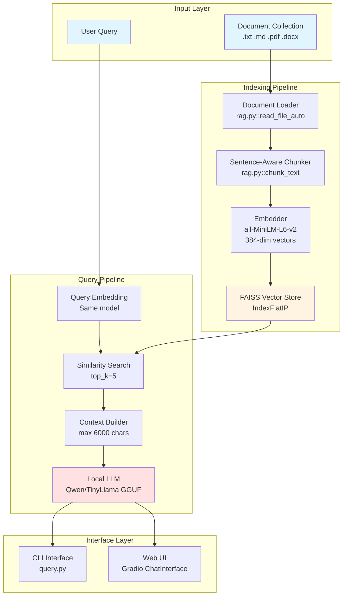
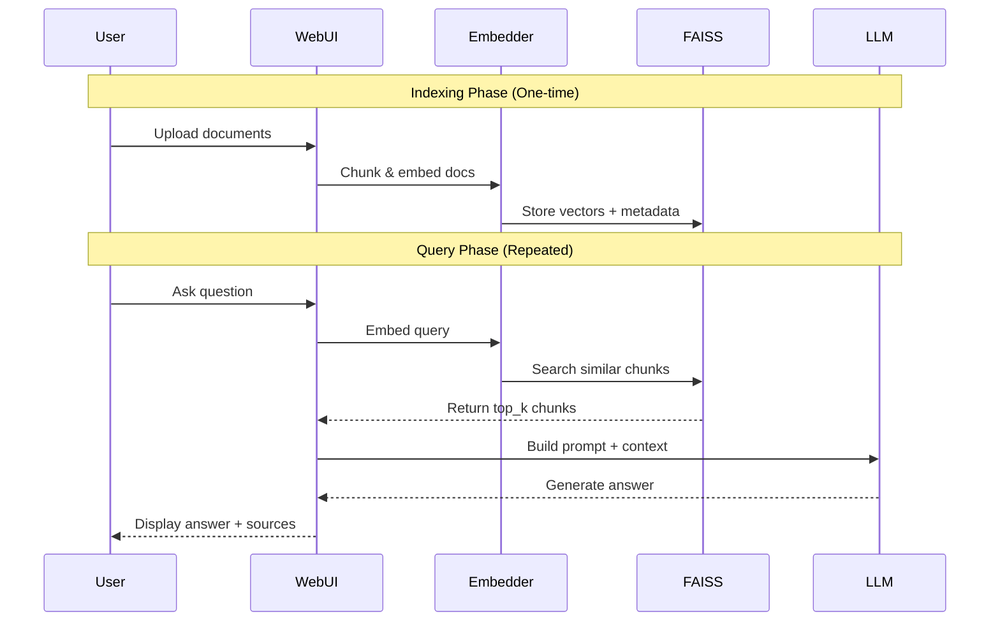
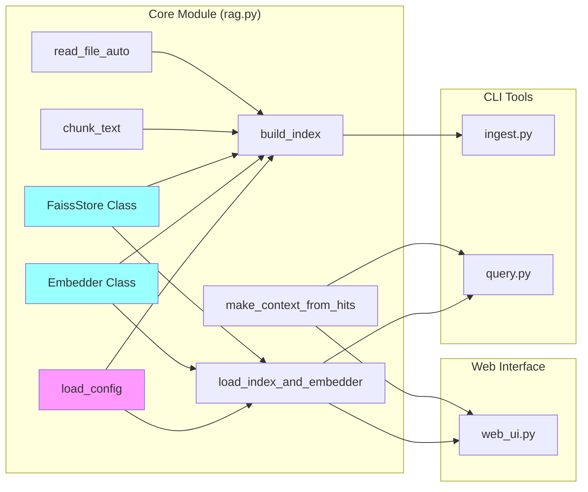

# Local RAG Application - Complete Documentation

## Table of Contents
1. [Overview](#overview)
2. [Architecture](#architecture)
3. [Requirements](#requirements)
4. [Configuration](#configuration)
5. [Components](#components)
6. [API Reference](#api-reference)
7. [Usage Examples](#usage-examples)
8. [Troubleshooting](#troubleshooting)

---

## Overview

This is a fully local Retrieval-Augmented Generation (RAG) application that enables question-answering over a private document collection without any cloud dependencies. The system uses:
- **Local embeddings** via SentenceTransformers (all-MiniLM-L6-v2)
- **Local vector database** via FAISS
- **Local LLM inference** via llama-cpp-python (CPU-optimized)
- **Web UI** via Gradio for easy interaction

### Key Features
- ✅ **100% Local**: No data leaves your machine
- ✅ **Multi-format support**: .txt, .md, .pdf, .docx
- ✅ **Sentence-aware chunking**: Intelligent text splitting
- ✅ **Source attribution**: Every answer cites source documents
- ✅ **Web & CLI interfaces**: Choose your preferred interaction method
- ✅ **CPU-optimized**: Runs on standard hardware

---

## Architecture

### System Architecture Diagram



### Data Flow



### Component Architecture



---

## Requirements

### System Requirements
- **OS**: Windows, Linux, or macOS
- **Python**: 3.9 - 3.13
- **RAM**: 8GB minimum (16GB recommended for larger models)
- **Storage**: ~5GB (embeddings model + LLM + dependencies)
- **CPU**: Modern multi-core processor (GPU optional but not required)

### Python Dependencies

| Package | Version | Purpose |
|---------|---------|---------|
| `sentence-transformers` | 3.2.1 | Local text embeddings |
| `faiss-cpu` | ≥1.13.1 | Vector similarity search |
| `llama-cpp-python` | 0.3.2 | GGUF model inference (CPU) |
| `pypdf` | 5.1.0 | PDF document parsing |
| `python-docx` | 1.1.2 | DOCX document parsing |
| `pyyaml` | 6.0.2 | Configuration file handling |
| `colorama` | - | CLI colored output |
| `gradio` | ≥4.0.0 | Web UI framework |

### Installation Command
```bash
pip install -r requirements.txt
```

### Supported Models

#### Embedding Models (via SentenceTransformers)
- `all-MiniLM-L6-v2` (default, 384-dim, 80MB)
- `all-mpnet-base-v2` (768-dim, better quality, 420MB)
- `paraphrase-multilingual-MiniLM-L12-v2` (384-dim, multilingual)

#### LLM Models (GGUF format via llama-cpp-python)
- **TinyLlama 1.1B Chat Q4_K_M** - 669MB, fast but lower quality
- **Qwen 2.5 3B Instruct Q4_K_M** - 2.1GB, balanced quality/speed ✅ Recommended
- **Phi-3.5-mini 3.8B Instruct Q4_K_M** - 2.2GB, Microsoft model
- **Llama 3.2 3B Instruct Q4_K_M** - 2GB, Meta model

---

## Configuration

### config.yaml Structure

```yaml
# Document and Index Paths
docs_dir: "c:/Users/karthik.nagaraj/Documents/GH-EDW Knowledge Base"
index_dir: "c:/Users/karthik.nagaraj/Documents/GH-EDW Knowledge Base/local_rag/index"

# Model Paths
model_path: "c:/Users/karthik.nagaraj/Documents/GH-EDW Knowledge Base/local_rag/models/qwen2.5-3b-instruct-q4_k_m.gguf"
embedding_model: "all-MiniLM-L6-v2"

# Retrieval Parameters
top_k: 5                    # Number of chunks to retrieve
chunk_size: 1200           # Characters per chunk
chunk_overlap: 200         # Overlap between chunks

# LLM Parameters
llm:
  n_ctx: 4096              # Context window size
  n_threads: null          # CPU threads (null = auto-detect)
  n_gpu_layers: 0          # GPU layers (0 = CPU-only)
  temperature: 0.2         # Sampling temperature (0-1)
  max_tokens: 512          # Max response length
```

### Configuration Parameters Explained

#### Document Processing
- **`docs_dir`**: Root directory containing your documents. The indexer recursively scans this folder.
- **`index_dir`**: Where FAISS index files are stored (`index.faiss`, `metadata.jsonl`, `embedding_model.txt`).

#### Chunking Strategy
- **`chunk_size`**: Max characters per chunk. Larger = more context but slower retrieval.
  - Recommended: 800-1500 for technical docs, 500-1000 for general text
- **`chunk_overlap`**: Characters shared between consecutive chunks. Prevents context loss at boundaries.
  - Recommended: 15-20% of chunk_size

#### Retrieval Settings
- **`top_k`**: Number of most similar chunks to retrieve per query.
  - Too low (1-2): May miss relevant context
  - Too high (10+): May add noise, exceed LLM context window
  - Recommended: 3-7

#### LLM Configuration
- **`n_ctx`**: Model context window. Must fit query + retrieved chunks + response.
  - Warning: Should not exceed model's training context (e.g., TinyLlama trained on 2048)
- **`temperature`**: Controls randomness.
  - 0.0-0.3: Focused, deterministic (better for factual Q&A)
  - 0.7-1.0: Creative, varied (better for open-ended generation)
- **`max_tokens`**: Max response length. Prevents overly long answers.

---

## Components

### Core Module: rag.py

#### Class: Embedder
```python
class Embedder:
    """Wrapper around SentenceTransformer for text embeddings."""
    
    def __init__(self, model_name: str)
    def encode(self, texts: List[str]) -> np.ndarray
    @property
    def dim() -> int  # Embedding dimension
```

**Key Methods:**
- `encode()`: Converts text(s) to dense vector representations
- `dim`: Returns embedding dimensionality (384 for all-MiniLM-L6-v2)

#### Class: FaissStore
```python
class FaissStore:
    """FAISS vector database wrapper with persistence."""
    
    def __init__(self, dimension: int)
    def add(self, embeddings: np.ndarray, metadatas: List[dict])
    def search(self, query_embedding: np.ndarray, k: int) -> Tuple[List[float], List[dict]]
    def save(self, index_path: str, metadata_path: str)
    def load(self, index_path: str, metadata_path: str)
```

**Key Methods:**
- `add()`: Inserts embeddings with associated metadata (text, source, chunk_id)
- `search()`: Finds k-nearest neighbors using cosine similarity (IndexFlatIP)
- `save()/load()`: Persists index to disk for reuse

#### Function: chunk_text()
```python
def chunk_text(text: str, chunk_size: int, overlap: int) -> List[str]
```
**Algorithm:**
1. Split text into sentences using regex (`[.!?]` boundaries)
2. Accumulate sentences until chunk_size reached
3. Add overlap by including last `overlap` characters from previous chunk
4. Ensures chunks respect sentence boundaries (no mid-sentence cuts)

**Example:**
```python
# Input: "Sentence one. Sentence two. Sentence three."
# chunk_size=20, overlap=5
# Output: ["Sentence one.", "one. Sentence two.", "two. Sentence three."]
```

#### Function: read_file_auto()
```python
def read_file_auto(filepath: str) -> str
```
**Supported Formats:**
- `.txt`, `.md`: Direct UTF-8 read
- `.pdf`: pypdf.PdfReader (extracts text from all pages)
- `.docx`: python-docx (extracts paragraphs and tables)

**Error Handling:** Returns empty string on parse failures

#### Function: build_index()
```python
def build_index(config: dict) -> Tuple[FaissStore, Embedder]
```
**Process:**
1. Scan `docs_dir` recursively for supported files
2. Load each file via `read_file_auto()`
3. Chunk text via `chunk_text()`
4. Embed all chunks in batches
5. Store in FAISS with metadata (source, chunk_id)
6. Persist to `index_dir`

**Output Files:**
- `index.faiss`: Binary FAISS index
- `metadata.jsonl`: One JSON object per chunk (text, source, chunk_id)
- `embedding_model.txt`: Model name for consistency checks

---

### CLI Tools

#### ingest.py - Index Builder
```bash
# Usage
python -m local_rag.src.ingest --config config.yaml

# Output
Building index from: c:/path/to/docs
Found 25 files
Processed 342 chunks from 25 files
Index saved to: c:/path/to/index
```

**Purpose:** One-time indexing of document collection. Re-run when documents change.

#### query.py - Q&A Interface

**One-shot Mode:**
```bash
python -m local_rag.src.query --config config.yaml --q "What is Grand Maison?"
```

**REPL Mode:**
```bash
python -m local_rag.src.query --config config.yaml --repl

# Interactive prompt
> What is Grand Maison?
> [Answer with sources]
> 
> How does it work?
> [Answer with sources]
```

**Key Function:**
```python
def answer_question(question: str, retriever, embedder, llm, config) -> Tuple[str, List[dict]]
    # 1. Embed query
    # 2. Retrieve top_k chunks
    # 3. Build context (max 6000 chars)
    # 4. Generate answer via LLM
    # 5. Return answer + source metadata
```

---

### Web Interface: web_ui.py

#### Launch Commands
```bash
# Local access only
python -m local_rag.src.web_ui --config config.yaml

# Public sharing (Gradio tunnel)
python -m local_rag.src.web_ui --config config.yaml --share

# Custom port
python -m local_rag.src.web_ui --config config.yaml --port 8080
```

#### Interface Features
- **Chat History**: Full conversation context
- **Example Questions**: Quick-start prompts
- **Source Citations**: Expandable markdown with filenames
- **Offline Mode**: `HF_HUB_OFFLINE=1` prevents network calls

#### Implementation Details
```python
# Core function
def answer(message: str, history: List) -> str:
    # 1. Call answer_question() from query.py
    # 2. Format response with markdown sources
    # 3. Return to Gradio ChatInterface
```

**Gradio Configuration:**
```python
interface = gr.ChatInterface(
    fn=answer,
    title="Local RAG Q&A",
    description="Ask questions about your documents",
    examples=["What is this document about?", "..."]
)
```

---

## API Reference

### rag.py API

#### load_config(config_path: str) -> dict
Loads YAML configuration file.

**Returns:** Dictionary with all config parameters

---

#### Embedder.encode(texts: Union[str, List[str]]) -> np.ndarray
Converts text(s) to embeddings.

**Args:**
- `texts`: Single string or list of strings

**Returns:** NumPy array of shape (num_texts, embedding_dim)

---

#### FaissStore.search(query_embedding: np.ndarray, k: int) -> Tuple[List[float], List[dict]]
Finds k-nearest neighbors.

**Args:**
- `query_embedding`: 1D array of shape (embedding_dim,)
- `k`: Number of results to return

**Returns:**
- List of similarity scores (higher = more similar)
- List of metadata dicts (text, source, chunk_id)

---

#### make_context_from_hits(hits: List[dict], max_chars: int = 6000) -> str
Builds context string from retrieved chunks.

**Args:**
- `hits`: List of metadata dicts from FAISS search
- `max_chars`: Max context length (truncates if exceeded)

**Returns:** Formatted string with chunk text and sources

---

### query.py API

#### answer_question(question: str, retriever, embedder, llm, config) -> Tuple[str, str]
Main Q&A function.

**Args:**
- `question`: User query string
- `retriever`: FaissStore instance
- `embedder`: Embedder instance
- `llm`: llama_cpp.Llama instance
- `config`: Configuration dict

**Returns:**
- Generated answer string
- Source attribution string (filenames, chunk counts)

---

## Usage Examples

### Example 1: Basic Indexing and Querying
```bash
# Step 1: Index your documents
python -m local_rag.src.ingest --config local_rag/config.yaml

# Step 2: Ask a question (CLI)
python -m local_rag.src.query \
  --config local_rag/config.yaml \
  --q "What are the main features of Grand Maison?"

# Output:
# Answer: Grand Maison is a customer relationship management system...
# Sources: grand_maison_overview.pdf (3 chunks), technical_specs.docx (2 chunks)
```

### Example 2: Interactive REPL
```bash
python -m local_rag.src.query --config local_rag/config.yaml --repl

> What is Grand Maison?
Grand Maison is a comprehensive platform for managing customer relationships...

> How does the subscription module work?
The subscription module allows customers to manage their service plans...

> exit
```

### Example 3: Web UI with Sharing
```bash
# Start web UI with public URL
python -m local_rag.src.web_ui --config local_rag/config.yaml --share

# Output:
# Running on local URL:  http://127.0.0.1:7860
# Running on public URL: https://abc123.gradio.live
```

### Example 4: Programmatic Usage
```python
from local_rag.src.rag import load_config, load_index_and_embedder
from local_rag.src.query import load_llm, answer_question

# Load resources
config = load_config("local_rag/config.yaml")
retriever, embedder = load_index_and_embedder(config)
llm = load_llm(config)

# Ask question
answer, sources = answer_question(
    "What is Grand Maison?",
    retriever, embedder, llm, config
)

print(f"Answer: {answer}")
print(f"Sources: {sources}")
```

---

## Troubleshooting

### Issue: "Module not found" errors
**Cause:** Dependencies not installed or wrong Python environment

**Solution:**
```bash
# Activate virtual environment
.venv\Scripts\activate  # Windows
source .venv/bin/activate  # Linux/Mac

# Install dependencies
pip install -r requirements.txt
```

---

### Issue: "Index not found" errors
**Cause:** Index not built yet

**Solution:**
```bash
# Build index first
python -m local_rag.src.ingest --config local_rag/config.yaml
```

---

### Issue: Slow indexing/querying
**Cause:** Large documents or slow CPU

**Solutions:**
- Reduce `chunk_size` in config.yaml (faster chunking)
- Use smaller embedding model (all-MiniLM-L6-v2 vs all-mpnet-base-v2)
- Reduce `top_k` (fewer chunks to retrieve)

---

### Issue: LLM produces spelling errors
**Cause:** Model too small (TinyLlama 1.1B)

**Solutions:**
1. Use larger model (Qwen 2.5 3B recommended)
2. Lower temperature (0.05 vs 0.2)
3. Add repetition_penalty (1.1)

---

### Issue: "Context window overflow" warning
**Cause:** `n_ctx` exceeds model's training context

**Solution:**
```yaml
# In config.yaml
llm:
  n_ctx: 2048  # Match model's training context
```

---

### Issue: Web UI not loading
**Cause:** Gradio version mismatch or network issues

**Solutions:**
1. Check Gradio version: `pip show gradio`
2. Ensure `HF_HUB_OFFLINE=1` set in web_ui.py
3. Try external browser instead of VS Code Simple Browser

---

### Issue: Poor answer quality
**Causes & Solutions:**

| Symptom | Likely Cause | Solution |
|---------|--------------|----------|
| Irrelevant answers | Poor retrieval | Increase `top_k`, improve chunking |
| Generic answers | Low temperature | Increase temperature to 0.4-0.7 |
| Hallucinations | Model too creative | Decrease temperature to 0.1-0.2 |
| No sources cited | Prompt engineering | Check SYSTEM_PROMPT in query.py |

---

## Performance Benchmarks

### Indexing Speed
- **Small corpus** (5 docs, 50 pages): ~10 seconds
- **Medium corpus** (30 docs, 300 pages): ~2 minutes
- **Large corpus** (100 docs, 1000 pages): ~8 minutes

### Query Latency
| Model | Context Size | Response Time |
|-------|--------------|---------------|
| TinyLlama 1.1B | 4 chunks (2000 chars) | ~3 seconds |
| Qwen 2.5 3B | 5 chunks (3000 chars) | ~8 seconds |
| Phi-3.5 3.8B | 5 chunks (3000 chars) | ~10 seconds |

*Tested on Intel i7-10700K (8 cores), 16GB RAM, CPU-only inference*

---

## Advanced Configuration

### Custom Embedding Model
```yaml
# In config.yaml
embedding_model: "paraphrase-multilingual-MiniLM-L12-v2"
```

**Note:** Requires re-indexing. Model name saved in `embedding_model.txt` for consistency.

### Custom LLM Prompt
Edit `SYSTEM_PROMPT` and `PROMPT_TEMPLATE` in `query.py`:

```python
SYSTEM_PROMPT = """You are a technical documentation assistant.
Answer questions concisely using ONLY the provided context.
Cite specific document names when possible."""

PROMPT_TEMPLATE = """[INST] <<SYS>>
{system_prompt}
<</SYS>>

Context:
{context}

Question: {question} [/INST]"""
```

### Multi-GPU Inference
```yaml
llm:
  n_gpu_layers: 35  # Offload 35 layers to GPU
```

**Requires:** CUDA-enabled llama-cpp-python build

---

## License & Credits

### Dependencies
- **SentenceTransformers**: Apache 2.0
- **FAISS**: MIT
- **llama.cpp**: MIT
- **Gradio**: Apache 2.0

### Models
- **all-MiniLM-L6-v2**: Apache 2.0 (sentence-transformers)
- **Qwen 2.5**: Apache 2.0 (Alibaba Cloud)
- **TinyLlama**: Apache 2.0 (TinyLlama Project)

---

**Last Updated:** December 16, 2025
**Version:** 1.0.0
