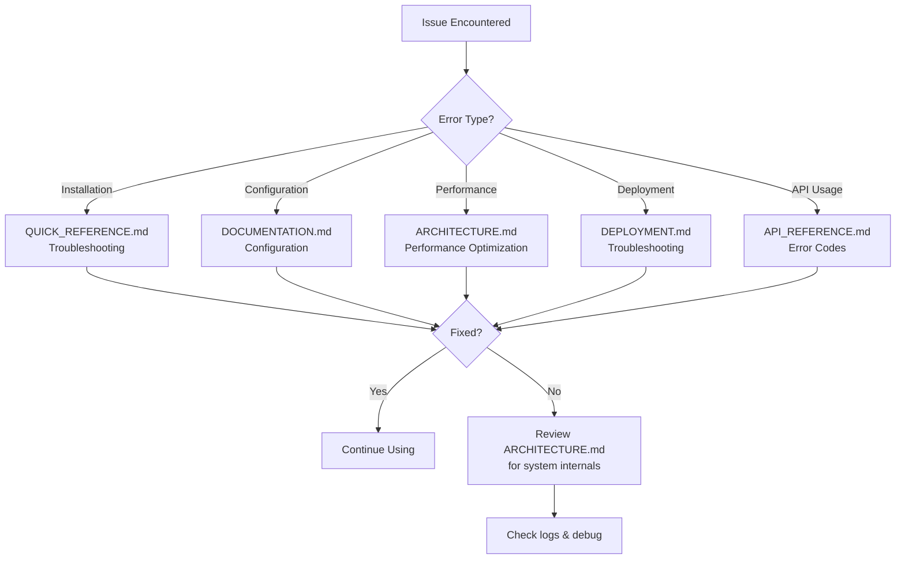

# Local RAG Project - Documentation Index

## Welcome to the Local RAG Documentation

This project provides a fully local Retrieval-Augmented Generation (RAG) system for answering questions about your private document collection without any cloud dependencies.

---

## 📚 Documentation Structure

### 🚀 Quick Start
**File:** [README.md](README.md)
- Installation instructions
- Basic usage examples
- Prerequisites
- Getting started in 5 minutes

### 📖 Complete Documentation
**File:** [DOCUMENTATION.md](DOCUMENTATION.md)
- **Comprehensive overview** of all features
- **Architecture diagrams** (Mermaid-based)
- **Requirements** and dependencies
- **Configuration** guide
- **Components** deep-dive
- **API reference** summary
- **Usage examples**
- **Troubleshooting** guide
- **Performance benchmarks**

### 🏗️ System Architecture
**File:** [ARCHITECTURE.md](ARCHITECTURE.md)
- **High-level architecture** diagrams
- **Component interactions** (C4 diagrams)
- **Data flow** diagrams (indexing & query)
- **Design decisions** and rationale
- **Scaling considerations**
- **Security architecture**
- **Performance optimization** strategies
- **Future enhancements** roadmap

### 🔧 API Reference
**File:** [API_REFERENCE.md](API_REFERENCE.md)
- **Complete API documentation** for all modules
- **Function signatures** with type hints
- **Class documentation** (Embedder, FaissStore)
- **Parameter descriptions**
- **Return value specifications**
- **Code examples** for each API
- **Error handling** guide
- **Performance characteristics**

### 🚢 Deployment Guide
**File:** [DEPLOYMENT.md](DEPLOYMENT.md)
- **Production deployment** strategies
- **System requirements** (min/recommended)
- **Installation steps** (Windows/Linux/macOS)
- **Deployment scenarios** (desktop, server, HA)
- **Security hardening** checklist
- **Monitoring & maintenance** guide
- **Backup strategies**
- **Update procedures**

### ⚡ Quick Reference
**File:** [QUICK_REFERENCE.md](QUICK_REFERENCE.md)
- **Command cheatsheet**
- **Configuration quick reference**
- **Troubleshooting quick fixes**
- **Common workflows**
- **Performance tuning** tips
- **Model recommendations**

---

## 📂 Project File Structure

```
local_rag/
├── Documentation Files
│   ├── README.md                   # Quick start guide
│   ├── DOCUMENTATION.md            # Complete documentation
│   ├── ARCHITECTURE.md             # System architecture
│   ├── API_REFERENCE.md            # API documentation
│   ├── DEPLOYMENT.md               # Production deployment
│   ├── QUICK_REFERENCE.md          # Quick reference
│   └── INDEX.md                    # This file
│
├── Source Code
│   └── src/
│       ├── __init__.py             # Package initialization
│       ├── rag.py                  # Core RAG engine (231 lines)
│       ├── ingest.py               # Index builder CLI
│       ├── query.py                # Q&A CLI interface
│       └── web_ui.py               # Gradio web UI
│
├── Configuration
│   ├── config.yaml                 # Main configuration file
│   └── requirements.txt            # Python dependencies
│
├── Data Directories
│   ├── models/                     # GGUF model storage
│   │   └── qwen2.5-3b-instruct-q4_k_m.gguf (2.1GB)
│   └── index/                      # FAISS index files
│       ├── index.faiss             # Binary vector index
│       ├── metadata.jsonl          # Chunk metadata
│       └── embedding_model.txt     # Model consistency check
│
└── Environment
    └── .venv/                      # Python virtual environment
```

---

## 🎯 Documentation Usage Guide

### For New Users
1. Start with [README.md](README.md) for quick setup
2. Reference [QUICK_REFERENCE.md](QUICK_REFERENCE.md) for common commands
3. Consult [DOCUMENTATION.md](DOCUMENTATION.md) for detailed features

### For Developers
1. Study [ARCHITECTURE.md](ARCHITECTURE.md) to understand system design
2. Use [API_REFERENCE.md](API_REFERENCE.md) for code integration
3. Review source code inline comments (rag.py, query.py, web_ui.py)

### For DevOps/SysAdmins
1. Follow [DEPLOYMENT.md](DEPLOYMENT.md) for production setup
2. Configure monitoring using Deployment Guide recommendations
3. Implement security checklist from DEPLOYMENT.md

---

## 🔍 Finding Information Quickly

### "How do I...?"

| Question | Documentation | Section |
|----------|--------------|---------|
| Install and run locally? | README.md | Setup |
| Configure chunking parameters? | DOCUMENTATION.md | Configuration |
| Deploy to production server? | DEPLOYMENT.md | Deployment Scenarios |
| Use the Python API? | API_REFERENCE.md | Module APIs |
| Understand the architecture? | ARCHITECTURE.md | System Overview |
| Fix common errors? | QUICK_REFERENCE.md | Troubleshooting |
| Improve response quality? | DOCUMENTATION.md | Troubleshooting |
| Scale for multiple users? | ARCHITECTURE.md | Scaling Considerations |
| Secure the application? | DEPLOYMENT.md | Security Hardening |
| Monitor performance? | DEPLOYMENT.md | Monitoring & Maintenance |

---

## 📊 Key Diagrams

### System Architecture Diagram
**Location:** [ARCHITECTURE.md](ARCHITECTURE.md#system-overview)
- Shows high-level component interaction
- Illustrates data flow from documents to answers

### Indexing Flow Diagram
**Location:** [ARCHITECTURE.md](ARCHITECTURE.md#indexing-flow-offline)
- Step-by-step indexing process
- Document loading → chunking → embedding → FAISS storage

### Query Flow Diagram
**Location:** [ARCHITECTURE.md](ARCHITECTURE.md#query-flow-online)
- Real-time query pipeline
- Question → retrieval → LLM generation → answer

### Component Architecture
**Location:** [ARCHITECTURE.md](ARCHITECTURE.md#component-architecture)
- Module dependencies
- Core classes and functions

---

## 🧪 Code Examples by Use Case

### Basic Usage (CLI)
```bash
# Index documents
python -m local_rag.src.ingest --config config.yaml

# Ask question
python -m local_rag.src.query --config config.yaml --q "What is this about?"
```
**Reference:** [README.md](README.md#usage)

### Web Interface
```bash
# Launch web UI
python -m local_rag.src.web_ui --config config.yaml
```
**Reference:** [DOCUMENTATION.md](DOCUMENTATION.md#usage-examples)

### Programmatic API
```python
from local_rag.src.rag import load_config, load_index_and_embedder
from local_rag.src.query import load_llm, answer_question

config = load_config("config.yaml")
retriever, embedder = load_index_and_embedder(config)
llm = load_llm(config)

answer, sources = answer_question(
    "Your question?",
    retriever, embedder, llm, config
)
```
**Reference:** [API_REFERENCE.md](API_REFERENCE.md#module-querypy)

### Production Deployment
```bash
# systemd service setup
sudo systemctl enable local-rag
sudo systemctl start local-rag
```
**Reference:** [DEPLOYMENT.md](DEPLOYMENT.md#scenario-2-team-server-internal-network)

---

## 🔧 Configuration Reference

### Key Configuration Files

| File | Purpose | Documentation |
|------|---------|---------------|
| config.yaml | Main configuration | [DOCUMENTATION.md](DOCUMENTATION.md#configuration) |
| requirements.txt | Python dependencies | [DEPLOYMENT.md](DEPLOYMENT.md#step-4-install-dependencies) |
| .env | Sensitive environment vars | [DEPLOYMENT.md](DEPLOYMENT.md#application-security) |

### Critical Configuration Parameters

```yaml
# Document & Index Paths
docs_dir: "/path/to/documents"      # Where your documents are stored
index_dir: "/path/to/index"         # Where FAISS index is saved
model_path: "/path/to/model.gguf"   # LLM model location

# Retrieval Settings
top_k: 5                            # Chunks to retrieve per query
chunk_size: 1200                    # Characters per chunk
chunk_overlap: 200                  # Overlap between chunks

# LLM Settings
llm:
  n_ctx: 4096                       # Context window size
  temperature: 0.2                  # Response randomness (0=deterministic)
  max_tokens: 512                   # Max response length
```

**Reference:** [DOCUMENTATION.md](DOCUMENTATION.md#configuration)

---

## 🆘 Troubleshooting Workflow



---

## 📈 Version History

| Version | Date | Documentation Changes |
|---------|------|----------------------|
| 1.0.0 | Dec 16, 2025 | Initial comprehensive documentation release |
| | | - Complete API reference |
| | | - Architecture diagrams (Mermaid) |
| | | - Deployment guide |
| | | - Quick reference |

---

## 🤝 Contributing to Documentation

### Documentation Standards
- **Clarity**: Use simple, clear language
- **Examples**: Include code examples for all features
- **Diagrams**: Use Mermaid for architecture diagrams
- **Links**: Cross-reference related documentation
- **Updates**: Keep version history current

### File Naming Conventions
- `README.md` - Entry point, quick start
- `DOCUMENTATION.md` - Comprehensive feature documentation
- `ARCHITECTURE.md` - Technical architecture details
- `API_REFERENCE.md` - API documentation
- `DEPLOYMENT.md` - Production deployment guide
- `QUICK_REFERENCE.md` - Quick lookup reference
- `INDEX.md` - This file (documentation index)

---

## 📞 Support Resources

### Documentation Files
- **Quick Help**: [QUICK_REFERENCE.md](QUICK_REFERENCE.md)
- **Detailed Guide**: [DOCUMENTATION.md](DOCUMENTATION.md)
- **Troubleshooting**: All documentation files have dedicated sections

### External Resources
- **SentenceTransformers**: https://www.sbert.net/
- **FAISS**: https://github.com/facebookresearch/faiss/wiki
- **llama.cpp**: https://github.com/ggerganov/llama.cpp
- **Gradio**: https://www.gradio.app/docs

---

## 🏁 Getting Started Checklist

Use this checklist with the corresponding documentation:

### Initial Setup
- [ ] Read [README.md](README.md) - 5 minutes
- [ ] Install dependencies ([DEPLOYMENT.md](DEPLOYMENT.md#step-4-install-dependencies))
- [ ] Download models ([DEPLOYMENT.md](DEPLOYMENT.md#step-5-download-models))
- [ ] Configure config.yaml ([DOCUMENTATION.md](DOCUMENTATION.md#configuration))
- [ ] Build index ([README.md](README.md#indexing))
- [ ] Test CLI query ([README.md](README.md#querying))
- [ ] Launch web UI ([README.md](README.md#web-ui))

### Understanding the System
- [ ] Review [ARCHITECTURE.md](ARCHITECTURE.md) diagrams
- [ ] Understand data flow ([ARCHITECTURE.md](ARCHITECTURE.md#data-flow-diagrams))
- [ ] Learn API basics ([API_REFERENCE.md](API_REFERENCE.md))

### Production Readiness
- [ ] Review [DEPLOYMENT.md](DEPLOYMENT.md) scenarios
- [ ] Implement security checklist ([DEPLOYMENT.md](DEPLOYMENT.md#security-hardening))
- [ ] Configure monitoring ([DEPLOYMENT.md](DEPLOYMENT.md#monitoring--maintenance))
- [ ] Set up backups ([DEPLOYMENT.md](DEPLOYMENT.md#backup-strategy))

---

## 📝 Documentation Maintenance

### When to Update Documentation

| Trigger | Files to Update |
|---------|----------------|
| New feature added | DOCUMENTATION.md, API_REFERENCE.md, ARCHITECTURE.md |
| Configuration change | DOCUMENTATION.md, QUICK_REFERENCE.md, config.yaml |
| Deployment change | DEPLOYMENT.md |
| Bug fix | Corresponding documentation section + changelog |
| Performance improvement | ARCHITECTURE.md, DEPLOYMENT.md |
| API change | API_REFERENCE.md, DOCUMENTATION.md |

---

**Last Updated:** December 16, 2025  
**Documentation Version:** 1.0.0  
**Project Version:** 1.0.0

---

## 🎓 Learning Path

### Beginner (First Day)
1. [README.md](README.md) - Setup and first query
2. [QUICK_REFERENCE.md](QUICK_REFERENCE.md) - Common commands

### Intermediate (First Week)
1. [DOCUMENTATION.md](DOCUMENTATION.md) - All features
2. [ARCHITECTURE.md](ARCHITECTURE.md) - System understanding
3. Experiment with config.yaml parameters

### Advanced (First Month)
1. [API_REFERENCE.md](API_REFERENCE.md) - Programmatic usage
2. [DEPLOYMENT.md](DEPLOYMENT.md) - Production deployment
3. [ARCHITECTURE.md](ARCHITECTURE.md) - Performance tuning

---

**Need help? Start with [QUICK_REFERENCE.md](QUICK_REFERENCE.md) for immediate answers!**
