```mermaid
graph TB
    subgraph "Google Cloud Platform"
        USER["👤 Users"]
        APPENGINE["🌐 App Engine<br/>Flask/Gradio"]
        CHUNKING["✂️ Cloud Functions<br/>Chunking Service"]
        EMBEDDING["🧠 Vertex AI<br/>Embedding API"]
        VECTORSEARCH["🔍 Vertex AI<br/>Vector Search"]
        CLOUDSQL["💾 Cloud SQL<br/>Metadata & Chunks"]
        VERTEX["🤖 Vertex AI LLM<br/>Generation"]
        STORAGE["💾 Cloud Storage<br/>Document Upload"]
    end
    
    DOC["📄 Documents"] -.->|Upload| STORAGE
    USER -->|Query| APPENGINE
    APPENGINE -->|Embed| EMBEDDING
    EMBEDDING -->|Store| VECTORSEARCH
    VECTORSEARCH -->|Retrieve| APPENGINE
    APPENGINE -->|Get metadata| CLOUDSQL
    APPENGINE -->|Generate| VERTEX
    VERTEX -->|Answer| USER
    
    STORAGE -->|Trigger| CHUNKING
    CHUNKING -->|Process| CLOUDSQL
    CHUNKING -->|Index| VECTORSEARCH
    
    style USER fill:#90EE90
    style VECTORSEARCH fill:#fff4e1
    style VERTEX fill:#ffe1e1
```

# Local RAG: Concept Explainer & Google Cloud Deployment Options

## Part 1: What We Built - Concept Explanation

### The Problem We're Solving

Organizations have valuable knowledge locked in documents—PDFs, Word files, internal wikis, product manuals, policy documents. When employees or customers ask questions, they have to:
- Search manually through hundreds of documents
- Hope Google finds the right page
- Lose productivity waiting for answers
- Struggle with outdated or conflicting information

**Traditional Approaches Don't Work:**
- Full-text search misses semantic meaning ("What payment methods do you support?" vs "We accept Visa, Mastercard, PayPal")
- Cloud AI services = privacy concerns + expensive API costs
- Generic ChatGPT = hallucinations with private documents
- Manual database entry = unsustainable for large document collections

### Our Solution: Local RAG

**RAG = Retrieval-Augmented Generation**

Instead of hoping an LLM knows about your private documents, we:

1. **Extract** all text from your documents (PDFs, DOCX, TXT, MD)
2. **Split** documents into meaningful chunks (respecting sentence boundaries)
3. **Embed** each chunk into a vector (384-dimensional semantic representation using all-MiniLM-L6-v2)
4. **Store** vectors in a searchable index (FAISS for fast similarity search)
5. **At query time:**
   - Convert user question to same vector format
   - Find most similar chunks in your knowledge base
   - Feed those chunks to LLM as context
   - LLM generates answer based only on your documents (reduces hallucinations)
   - Return answer + citations (which documents it came from)

### Why This Approach Works

```
Traditional LLM:
User Question → LLM → Answer (may hallucinate)

RAG System:
User Question → Similarity Search → Find Relevant Chunks → LLM 
            → Answer grounded in YOUR documents → Citation

Result: Accurate, sourced, trustworthy answers
```

### Key Advantages

| Aspect | Local RAG | Cloud API | Generic ChatGPT |
|--------|-----------|-----------|-----------------|
| **Data Privacy** | 100% local, no cloud | Risk of logging | Sent to OpenAI |
| **Cost** | One-time model download | $0.001-0.01 per query | Ongoing API costs |
| **Accuracy** | Grounded in your docs | Generic knowledge | May hallucinate |
| **Latency** | ~8 seconds (CPU) | Network dependent | Network dependent |
| **Customization** | Full control | Limited | None |
| **Compliance** | HIPAA/SOC2 ready | Vendor dependent | Not suitable |

### How Chunking & Embedding Works

**Example:**
```
Document: "Grand Maison is a customer relationship management system. 
It provides tools for managing customer interactions. Key features include 
contact management, sales pipeline tracking, and customer service integration."

Chunking (1200 chars, 200 overlap):
- Chunk 1: "Grand Maison is a customer relationship management system. 
  It provides tools for managing customer interactions. Key features include..."
- Chunk 2: "Key features include contact management, sales pipeline tracking, 
  and customer service integration..."

Embedding (all-MiniLM-L6-v2):
- Chunk 1 → [0.234, -0.156, 0.892, ..., 0.445]  (384 dimensions)
- Chunk 2 → [0.321, -0.203, 0.765, ..., 0.512]

User Question: "How do I track sales?"
- Question embedding: [0.289, -0.178, 0.821, ..., 0.468]
- Similarity to Chunk 1: 0.92 (HIGH - include!)
- Similarity to Chunk 2: 0.88 (HIGH - include!)
- Result: Both chunks passed to LLM as context
```

### The Complete Pipeline


### Real-World Use Cases

1. **Enterprise Support** - Employee asks "What's our return policy?" → System searches 500-page employee handbook → Returns relevant policy with source
2. **Medical Records** - Doctor asks "What was this patient's medication history?" → Searches through years of patient records → Returns relevant info + citation
3. **Legal Research** - Lawyer searches "precedent for contract breach" → Finds relevant clauses from thousands of contracts → Returns with document source
4. **Product Knowledge** - Customer support searches "How do I reset my password?" → Searches product manual → Returns step-by-step instructions with screenshot reference
5. **Training Material** - New employee asks "What's our onboarding process?" → Searches training docs → Returns personalized answer from official materials

---

## Part 2: Google Cloud Deployment Options

### Architecture Overview

We'll explore three production-ready Google Cloud implementations, each trading off cost vs. features vs. privacy.

---

## Option 1: Hybrid Approach - Local Storage + Vertex AI LLM

### Use Case
Organizations want local data privacy but prefer managed ML infrastructure for LLM inference.

### Architecture


### Components

**On-Premises:**
- FAISS vector database (local storage, 10GB-1TB depending on documents)
- Chunking & embedding pipeline (runs once, then incremental)
- Local LAN/WiFi connectivity

**Google Cloud:**
- **Cloud Run** - Query API endpoint (auto-scales, pay per request)
- **Vertex AI** - Access to Google's LLMs (PaLM 2, Claude, Gemini)
- **Cloud Logging** - Audit trail and analytics
- **Cloud Storage** - Optional backup of vector index

### Key Benefits
✅ Local data stays local (FAISS index never leaves premises)  
✅ Use Google's best-in-class LLMs  
✅ Serverless (no infrastructure to manage)  
✅ Enterprise-grade logging & security  
✅ Pay only for LLM API calls

### Implementation Code

```python
# On-premises query handler
from google.cloud import aiplatform
from local_rag.src.rag import load_index_and_embedder

# Load local resources
config = load_config("config.yaml")
retriever, embedder = load_index_and_embedder(config)

# Initialize Vertex AI endpoint
aiplatform.init(project="my-project", location="us-central1")
endpoint = aiplatform.Endpoint("projects/123/locations/us-central1/endpoints/456")

async def answer_with_vertex_ai(question: str):
    # Retrieve from local FAISS
    query_vec = embedder.encode(question)
    scores, chunks = retriever.search(query_vec, k=5)
    context = make_context_from_hits(chunks)
    
    # Send to Vertex AI (only context + question, no raw docs)
    prompt = f"""Context:
{context}

Question: {question}

Answer based only on the context provided."""
    
    # Call Vertex AI endpoint
    response = await endpoint.predict(
        instances=[{"prompt": prompt}]
    )
    
    return response.predictions[0]["content"]
```

### Cost Estimate (Monthly)

- **Cloud Run:** $0.04 per 100k requests (typically negligible)
- **Vertex AI LLM:** $0.0035-0.015 per 1k input tokens + $0.007-0.03 per 1k output tokens
- **Logging:** ~$0.50 per GB ingested

**Example:** 1000 queries/day = ~$180/month in LLM costs

### Compliance & Security
✅ HIPAA eligible (with Business Associate Agreement)  
✅ FedRAMP moderate (for government)  
✅ Data residency in your region  
✅ VPC-SC compatible (isolated network)

---

## Option 2: Fully Managed - Google Cloud SQL + Vertex AI Vector Search

### Use Case
Organizations want everything on Google Cloud but need vector search performance + managed infrastructure.

### Architecture



### Components

| Component | Purpose | Google Service |
|-----------|---------|-----------------|
| Document upload | Ingest user documents | Cloud Storage |
| Chunking | Split documents | Cloud Functions |
| Embeddings | Convert text to vectors | Vertex AI Embedding API |
| Vector search | Find similar chunks | Vertex AI Vector Search |
| Metadata store | Store chunk text/sources | Cloud SQL (PostgreSQL) |
| Query interface | Web UI | App Engine or Cloud Run |
| LLM | Generate answers | Vertex AI Models |

### Key Benefits
✅ Serverless & managed (no ops burden)  
✅ Auto-scaling for traffic spikes  
✅ Built-in vector search with ~1ms latency  
✅ All data in Google Cloud (one vendor)  
✅ Easy backup & disaster recovery  
✅ Fine-grained IAM & audit logging

### Implementation Steps

**1. Create Vector Search Index**
```yaml
# Create in Vertex AI Console or via gcloud
gcloud ai indexes create my-rag-index \
    --display-name="RAG Vector Index" \
    --dimension=768 \
    --approximate-neighbors-count=150
```

**2. Embedding Pipeline (Cloud Function)**
```python
import functions_framework
from google.cloud import aiplatform
from google.cloud import sql

@functions_framework.cloud_event
def process_document(cloud_event):
    """Triggered when document uploaded to Cloud Storage"""
    bucket_name = cloud_event['bucket']
    file_name = cloud_event['name']
    
    # Load & chunk document
    doc = load_from_gcs(bucket_name, file_name)
    chunks = chunk_text(doc)
    
    # Get embeddings from Vertex AI
    embeddings_client = aiplatform.Embeddings(
        model_name="textembedding-gecko@003"
    )
    embeddings = embeddings_client.get_embeddings(chunks)
    
    # Store in Cloud SQL
    conn = sql.connect(connection_name="my-project:us-central1:rag-db")
    for chunk, embedding in zip(chunks, embeddings):
        store_chunk(conn, chunk, embedding, file_name)
    
    # Index in Vector Search
    index = aiplatform.MatchingEngineIndex("projects/123/locations/us-central1/indexes/456")
    index.add_data_points(embeddings=embeddings, ids=chunk_ids)
```

**3. Query API (Cloud Run)**
```python
from flask import Flask, request
from google.cloud import aiplatform
from google.cloud import sql

app = Flask(__name__)

@app.route("/query", methods=["POST"])
def query():
    question = request.json["question"]
    
    # Get embedding
    embeddings = aiplatform.Embeddings("textembedding-gecko@003")
    q_embedding = embeddings.get_embeddings([question])[0]
    
    # Search Vector Search
    index = aiplatform.MatchingEngineIndex(INDEX_NAME)
    results = index.query(embeddings=[q_embedding.values], k=5)
    
    # Fetch chunk text from Cloud SQL
    conn = sql.connect(DB_CONNECTION_NAME)
    chunks_text = get_chunks_by_ids(conn, [r.id for r in results])
    context = "\n".join(chunks_text)
    
    # Generate with Vertex AI LLM
    model = aiplatform.GenerativeModel("gemini-pro")
    response = model.generate_content(f"Context:\n{context}\n\nQuestion: {question}")
    
    return {"answer": response.text, "sources": get_sources(results)}
```

### Cost Estimate (Monthly)

- **App Engine:** $0.05-0.25 per day + compute (typically $15-50/month)
- **Cloud Functions:** $0.40 per 1M invocations (first 2M free)
- **Vertex AI Embedding API:** $0.0001 per 1k requests
- **Vertex AI LLM:** $0.0035-0.015 per 1k input tokens
- **Vector Search:** $0.25 per million queries
- **Cloud SQL:** $10-50/month for small instance

**Total estimate:** $150-300/month for small to medium workload

### Use Case: When to Choose This
- ✅ Data is non-sensitive (fine with Google Cloud)
- ✅ Want managed infrastructure
- ✅ Need high availability (multi-region)
- ✅ Performance is critical (low latency required)
- ✅ Compliance with Google Cloud acceptable

---

## Option 3: Teradata Vector Store + Google Cloud Integration

### Use Case
Organizations with existing Teradata data warehouse want to integrate RAG without moving data.

### Architecture



```mermaid
graph TB
    subgraph "On-Premises / Existing Infrastructure"
        TERADATA["🗄️ Teradata Data Warehouse<br/>Existing Data"]
        TERADATA_VDB["🔍 Teradata Vector Store<br/>New Feature"]
    end
    
    subgraph "Google Cloud"
        DATASTREAM["🔄 Datastream<br/>CDC Pipeline"]
        PUBSUB["📨 Pub/Sub<br/>Event Stream"]
        VERTEX["🤖 Vertex AI<br/>LLM Endpoint"]
        APPENGINE["🌐 App Engine<br/>Query Interface"]
        BIGQUERY["📊 BigQuery<br/>Analytics"]
    end
    
    DOC["📄 Documents"] -->|Load into| TERADATA
    TERADATA -->|Extract vectors| TERADATA_VDB
    TERADATA_VDB -->|CDC replication| DATASTREAM
    DATASTREAM -->|Stream events| PUBSUB
    PUBSUB -->|Trigger indexing| APPENGINE
    APPENGINE -->|Query| TERADATA_VDB
    APPENGINE -->|Generate| VERTEX
    VERTEX -->|Answer| USER["👤 User"]
    APPENGINE -->|Log queries| BIGQUERY
    
    style TERADATA fill:#fff4e1
    style VERTEX fill:#ffe1e1
    style APPENGINE fill:#e1f5ff
```

### Why Teradata for Vector Search?

**Teradata Vector Capabilities:**
- Store vectors alongside structured data (no separate system)
- Native vector operations: cosine similarity, L2 distance, dot product
- SQL queries for hybrid search (vectors + metadata filters)
- Massive scale: handles trillions of vectors
- No vendor lock-in: open standards
- Integrates with existing data governance

### Components

| Component | Purpose | Technology |
|-----------|---------|------------|
| Vector storage | Store document embeddings | Teradata Vector Column Type |
| Similarity search | Find related vectors | Teradata VECTOR_DISTANCE() |
| Metadata | Document source, chunk ID, date | Teradata standard columns |
| Replication | Sync with Google Cloud | Datastream (CDC) |
| LLM | Generate answers | Vertex AI |
| Analytics | Query patterns, performance | BigQuery |

### Implementation

**1. Teradata Vector Column Schema**
```sql
-- Teradata table structure
CREATE TABLE document_vectors (
    document_id VARCHAR(100),
    chunk_id INT,
    chunk_text VARCHAR(4000),
    embedding VECTOR(384),  -- all-MiniLM-L6-v2 dimension
    source_file VARCHAR(255),
    upload_date TIMESTAMP,
    PRIMARY INDEX (document_id)
);

-- Create vector index for fast search
CREATE INDEX idx_embedding ON document_vectors (embedding) USING VECTOR_INDEX;
```

**2. Vector Similarity Search in Teradata SQL**
```sql
-- Find top 5 similar chunks using Cosine Similarity
SELECT 
    chunk_id,
    chunk_text,
    source_file,
    VECTOR_DISTANCE(embedding, :query_embedding, 'COSINE') AS similarity_score
FROM document_vectors
WHERE VECTOR_DISTANCE(embedding, :query_embedding, 'COSINE') > 0.7
ORDER BY similarity_score DESC
LIMIT 5;
```

**3. Google Cloud Query Interface (Cloud Run)**
```python
from flask import Flask, request
import teradatasql
from google.cloud import aiplatform

app = Flask(__name__)

# Connect to Teradata
teradata_connection = teradatasql.connect(
    host="teradata.company.com",
    user="rag_user",
    password=get_from_secret_manager("teradata_password")
)

@app.route("/query", methods=["POST"])
def query_with_teradata_vectors():
    question = request.json["question"]
    
    # Get embedding from Vertex AI
    embeddings_client = aiplatform.Embeddings("textembedding-gecko@003")
    q_embedding = embeddings_client.get_embeddings([question])[0].values
    
    # Query Teradata for similar vectors
    cursor = teradata_connection.cursor()
    cursor.execute("""
        SELECT chunk_id, chunk_text, source_file, similarity_score
        FROM (
            SELECT 
                chunk_id,
                chunk_text,
                source_file,
                VECTOR_DISTANCE(embedding, ?, 'COSINE') AS similarity_score
            FROM document_vectors
            WHERE VECTOR_DISTANCE(embedding, ?, 'COSINE') > 0.75
        ) AS ranked
        ORDER BY similarity_score DESC
        LIMIT 5
    """, [q_embedding, q_embedding])
    
    results = cursor.fetchall()
    context = "\n".join([r[1] for r in results])  # Chunk text
    sources = [r[2] for r in results]  # Source files
    
    # Generate answer with Vertex AI
    model = aiplatform.GenerativeModel("gemini-pro")
    response = model.generate_content(f"Context:\n{context}\n\nQuestion: {question}")
    
    # Log to BigQuery for analytics
    log_query_to_bigquery(question, response.text, sources)
    
    return {
        "answer": response.text,
        "sources": sources,
        "similarity_scores": [r[3] for r in results]
    }
```

**4. Datastream for Real-time Sync**
```bash
# Create Datastream replication from Teradata to BigQuery
gcloud datastream create-connection-profiles \
    --display-name="Teradata Profile" \
    --type=teradata \
    --teradata-hostname=teradata.company.com \
    --teradata-database=rag_db

# Create stream job
gcloud datastream create-stream \
    --display-name="RAG Vector Sync" \
    --source="teradata-profile" \
    --destination="bigquery" \
    --stream-objects=document_vectors
```

### Key Benefits
✅ Keep data in Teradata (no migration)  
✅ Leverage existing data warehouse investment  
✅ Native vector operations (built-in, not add-on)  
✅ Hybrid queries (vectors + traditional SQL)  
✅ Easy replication to Google Cloud for analytics  
✅ Enterprise-grade security & governance

### Use Cases for Teradata Option
- ✅ Already using Teradata for data warehouse
- ✅ Sensitive data must stay in existing infrastructure
- ✅ Need hybrid vector + SQL queries
- ✅ Large-scale document repositories (millions+ vectors)
- ✅ Complex metadata filtering required

### Cost Estimate
- **Teradata:** Depends on existing license (included in current spend)
- **Datastream:** ~$0.01-0.05 per GB replicated
- **BigQuery:** ~$0.025 per GB queried (first 1 TB/month free)
- **Vertex AI LLM:** $0.0035-0.015 per 1k tokens

**Incremental cost:** ~$50-100/month added to Teradata spend

---

## Option 4: Cohere LLM + Vertex AI Vector Search

### When to Use Cohere LLM

Cohere is best for these specific scenarios:

**Scenario 1: Multilingual RAG**
- Organizations operating in multiple languages (Spanish, French, German, Japanese, etc.)
- Cohere's models have strong multilingual capabilities
- No need to translate documents or queries

**Example:**
```
User (Spanish): "¿Cómo es el proceso de devolución?"
→ Cohere multilingual model understands Spanish directly
→ Returns answer in Spanish: "El proceso de devolución es..."
```

**Scenario 2: Domain-Specific Fine-Tuning**
- Need to fine-tune LLM for specialized terminology (medical, legal, technical)
- Cohere allows fine-tuning on custom data
- Cheaper than OpenAI fine-tuning

**Example:**
```
Medical Domain:
- Train Cohere model on 10,000 medical documents
- Model learns medical terminology, treatment protocols
- Better accuracy for clinical Q&A

Cost: ~$100-500 for fine-tuning vs $1000+ for OpenAI
```

**Scenario 3: Long Document Summarization**
- Need to process documents longer than typical context windows
- Cohere's Rerank model is particularly good at understanding document relevance
- Can chunk and summarize documents efficiently

**Example:**
```
200-page technical manual → 
Cohere Rerank scores all 50 chunks for relevance →
Summarizes top 10 chunks →
Generates executive summary
```

**Scenario 4: Cost-Optimized Production**
- High-volume production system (10k+ queries/day)
- Cohere pricing is lower than OpenAI/Anthropic
- Performance is enterprise-grade

**Example:**
```
10,000 queries/day × $0.001 per query = $10/day
OpenAI GPT-4: $0.01+ per query = $100/day
```

### Architecture with Cohere

```mermaid
graph TB
    subgraph "Google Cloud"
        USER["👤 User"]
        APPENGINE["🌐 App Engine<br/>Query API"]
        VECTORSEARCH["🔍 Vertex AI<br/>Vector Search"]
        COHERE_API["🤖 Cohere API<br/>Command/Rerank"]
    end
    
    USER -->|Query| APPENGINE
    APPENGINE -->|Search| VECTORSEARCH
    VECTORSEARCH -->|Get chunks| APPENGINE
    APPENGINE -->|Rank & Generate| COHERE_API
    COHERE_API -->|Answer| APPENGINE
    APPENGINE -->|Response| USER
    
    style COHERE_API fill:#ffe1e1
    style VECTORSEARCH fill:#fff4e1
```



### Implementation with Cohere

**1. Reranking for Better Relevance**
```python
import cohere
from google.cloud import aiplatform

co = cohere.Client(api_key="your-cohere-key")

async def query_with_cohere_rerank(question: str):
    # Get initial candidates from Vector Search
    vector_search = aiplatform.MatchingEngineIndex(INDEX_NAME)
    candidates = vector_search.query(
        embeddings=[get_embedding(question)], 
        k=20  # Get more candidates for reranking
    )
    
    # Fetch chunk texts
    chunk_texts = [get_chunk_text(c.id) for c in candidates]
    
    # Rerank with Cohere (better relevance scoring)
    rerank_response = co.rerank(
        model="rerank-english-v2.0",
        query=question,
        documents=chunk_texts,
        top_n=5  # Keep only top 5
    )
    
    # Use reranked chunks
    top_chunks = [chunk_texts[r.index] for r in rerank_response.results]
    context = "\n".join(top_chunks)
    
    # Generate with Cohere Command
    response = co.generate(
        model="command",
        prompt=f"Context:\n{context}\n\nQuestion: {question}",
        max_tokens=200,
        temperature=0.7
    )
    
    return response.generations[0].text
```

**2. Fine-Tuned Cohere Model**
```python
# Train on domain-specific data
import cohere

co = cohere.Client(api_key="your-cohere-key")

# Fine-tune for medical domain
fine_tune = co.fine_tune(
    model="command",
    train_data=[
        {"prompt": "What is diabetes?", "completion": "Diabetes is a medical condition..."},
        {"prompt": "Symptoms of hypertension?", "completion": "High blood pressure symptoms..."},
        # ... more training examples
    ]
)

# Use fine-tuned model for queries
response = co.generate(
    model=fine_tune.id,  # Custom fine-tuned model
    prompt=f"Question: {question}\nAnswer:",
    max_tokens=200
)
```

**3. Multilingual RAG with Cohere**
```python
async def multilingual_query(question: str, language: str):
    """Support queries in any language"""
    
    # Cohere Command understands ~100 languages
    query_text = f"[{language}] {question}"
    
    # Get embedding (language-agnostic)
    embedding = get_embedding(question)
    
    # Search (embeddings are language-independent)
    candidates = vector_search.query(embeddings=[embedding], k=10)
    
    # Generate answer in same language as question
    response = co.generate(
        model="command",
        prompt=f"Context:\n{context}\n\nQuestion: {query_text}\nAnswer:",
        max_tokens=200
    )
    
    return response.generations[0].text  # Automatically in user's language
```

### Cost Comparison: Cohere vs Alternatives

| Metric | Cohere | GPT-4 | Claude | Gemini |
|--------|--------|-------|--------|--------|
| Generation (1k tokens) | $0.001 | $0.015 | $0.008 | $0.0035 |
| Reranking (100 docs) | $0.01 | N/A | N/A | N/A |
| Fine-tuning cost | Low ($100) | High ($1000+) | Medium | Medium |
| Multilingual | Native | Translated | Translated | Native |
| Latency | ~200ms | ~500ms | ~300ms | ~250ms |

### When to Choose Cohere
- ✅ Multilingual documents/users required
- ✅ Need fine-tuning for domain customization
- ✅ Document reranking important for quality
- ✅ Cost is optimization goal
- ✅ Latency-sensitive applications

---

## Comparison Matrix: All Options

| Feature | Local RAG | Option 1: Hybrid | Option 2: Managed | Option 3: Teradata | Option 4: Cohere |
|---------|----------|------------------|-------------------|-------------------|-----------------|
| **Data Privacy** | 100% local | High (hybrid) | Medium | High | Medium |
| **Infrastructure** | Self-hosted | Local + Cloud | Fully managed | Local + Cloud | Cloud native |
| **Scaling** | Manual | Auto (LLM) | Full auto | Manual | Full auto |
| **Cost** | Low (~$0) | Medium (~$200) | Medium (~$200) | Low (~$50) | Low (~$150) |
| **Performance** | Medium (8s) | Medium (8s) | High (fast) | Medium (variable) | High (fast) |
| **Compliance** | HIPAA ready | HIPAA ready | HIPAA ready | HIPAA ready | SOC2 ready |
| **Best for** | Sensitive data | Privacy + managed LLM | Fully cloud | Enterprise DW | Multilingual/fine-tune |

---

## Recommendation Matrix

Choose based on your needs:

```
Privacy Requirement?
├─ YES, absolute privacy → Option 1 (Hybrid) or Local RAG
└─ NO, data can be in cloud?
   ├─ YES → Option 2 (Fully Managed)
   └─ Existing Teradata? → Option 3 (Teradata Vector)

Need Multilingual?
├─ YES → Option 4 (Cohere LLM)
└─ NO → Any option works

Cost is priority?
├─ YES → Option 3 (Teradata) or Option 4 (Cohere)
└─ NO → Option 2 (Managed)

Scale requirement?
├─ >1M queries/month → Option 2 (Managed)
├─ >100M queries/month → Option 3 (Teradata) + Option 4 (Cohere)
└─ <100k queries/month → Any option works
```

---

## Implementation Roadmap

### Phase 1: Proof of Concept (Week 1-2)
- Deploy Option 1 (Hybrid) with existing local RAG
- Integrate Vertex AI LLM via Cloud Run
- Test with 100-doc sample corpus
- Measure latency & cost

### Phase 2: Scaling (Week 3-4)
- Evaluate Options 2, 3, 4 based on results
- Set up chosen option in test environment
- Performance & cost benchmarking

### Phase 3: Production (Week 5-8)
- Deploy to production
- Set up monitoring & logging
- Train team on operations
- Implement backup & disaster recovery

---

**Conclusion:** Choose Local RAG for maximum privacy, or migrate to Google Cloud with your preferred integration point based on data governance, cost, and multilingual requirements.
