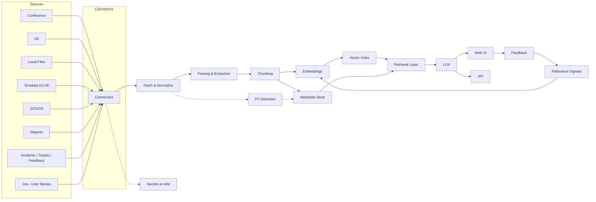

# Information Architecture — RAG Ingestion & Query Pipeline 🔧

> Diagram and notes describing what the RAG app can ingest, how data flows, and how metadata/indices are organized.

## Diagram (Mermaid)

---

## Key Components

- **Sources**: Confluence pages, Git repos (Markdown, SQL), local documents (PDF/DOCX), Teradata (GCVE) exports or CDC, cloud buckets (GCS/S3), reporting systems (BigQuery, Looker), **operations** sources (incident/ticket systems and customer feedback), and **delivery** sources (Jira user stories, epics).  
- **Connectors**: Lightweight, incremental syncers (APIs or agents in GCVE for Teradata). Prefer running a connector inside GCVE for Teradata to use private networking.  
- **Fetch & Normalize**: Download file, capture original path/URL, compute checksum, set base metadata (owner, source, created_at).  
- **Parsing**: PDF/Word/OCR, HTML/Confluence rendering, SQL/DDL extraction, CSV/Parquet parsing (extract schema).  
- **Chunking & Embedding**: Overlapping chunks (configurable). Embed each chunk and persist vector. Keep `embedding_model.txt` to record model/version.  
- **Index & Metadata**: FAISS (vector) + JSONL/SQLite/Elasticsearch (metadata & faceting). Use fields to support filters (doc_type, project, owner, confidentiality).  
- **Retrieval**: Top-K nearest neighbors, apply metadata filters, build context for LLM prompt.  
- **LLM & UI**: Local LLM (Qwen GGUF) generates answers; UI shows answer + citations and allows user feedback.  
- **Feedback loop**: Collect feedback for relevance, corrections for hallucinations; schedule reindex/retrain.

---

## Recommended Minimal Metadata Schema

| Field | Type | Purpose |
|---|---:|---|
| doc_id | string (UUID) | Unique document identifier |
| source | enum | {confluence, git, teradata, gcs, local, bigquery} |
| doc_type | enum | {requirements, design, mapping, sql, runbook, dashboard} |
| project | string | Project / LOB / domain |
| owner | string | Team or person responsible |
| path_or_url | string | Link to original source |
| format | string | pdf, docx, md, sql, parquet |
| created_at / updated_at | datetime | Timestamps |
| confidentiality | enum | {public, internal, restricted} |
| teradata_table | string (optional) | If doc is table/DDL mapping |
| chunk_index | int | For chunk provenance |
| embedding_id / vector_id | string | Link to the vector entry |

---

## Example document types & what to extract

- **Requirements**: acceptance criteria, owner, priority, affected systems.  
- **Design/Architecture**: diagrams (extract text labels), component names, network details (e.g., GCVE), owner.  
- **Mapping / ETL**: source_table → target_table mapping, field-level transformations, jobs that run them, schedule.  
- **SQL, Views & Procedures**: DDL, definitions, authors, last-modified, typical query patterns.  
- **Reports / Dashboards**: metric definitions, source views, frequencies.
- **Operations**: incidents, trouble tickets, support logs, customer feedback; extract incident ID, priority, affected services, timeline, resolution steps, and related runbooks.
- **Delivery**: Jira user stories, epics, and tasks; extract story ID, acceptance criteria, owner, sprint, linked components, and related PRs.

---

## UX & Query Examples to validate

- "Which documents describe the MENSA VIEWS table lineage?" → returns mapping doc + architecture page + relevant SQL snippets.  
- "Who owns the ETL jobs that populate `VLOCATION_HIST`?" → returns runbook / owner info.  
- "Show column mapping from `ORDERS` → `ODS_ORDERS`" → returns mapping doc and chunked mapping table.  

---

## End users & sample use cases

- **Data Engineer / ETL Owner** — Use cases: "Which jobs populate `VLOCATION_HIST` and who owns them?"; "Show recent incidents affecting the `MENSA` data pipeline."  
- **Support / SRE / On-call** — Use cases: "Show runbooks and incident resolution steps for recent outages"; "List open tickets related to Teradata replication."  
- **Data Analyst / BI Developer** — Use cases: "Where is metric X defined and which views feed the dashboard?"; "Find SQL used by view `VACCOUNT`."  
- **Product Manager / Delivery** — Use cases: "Which Jira stories implement feature Y? What acceptance criteria were agreed?"; "Show related design docs and PRs."  
- **Data Steward / Compliance** — Use cases: "Which documents discuss PII handling or retention policies?"; "List confidential datasets and owners."  
- **Developer** — Use cases: "Where is the SQL or ETL code that creates this view? What PR changed it?"  
- **Business Analyst / PM** — Use cases: "Summarize recent customer feedback about billing issues and link to support tickets."

## Implementation Checklist (prioritized)

1. Create connectors for Confluence and Git (incremental sync).  
2. Implement parsing pipeline and chunking with metadata capture.  
3. Build FAISS index and JSONL metadata store; add small QA test suite with 20 queries.  
4. Add UI features: source citations, filters (doc_type, project), feedback buttons.  
5. Add PII detection and confidentiality tagging early in pipeline.  
6. Add monitoring and periodic reindex/retrain job.

---

## Security & Governance Notes 🔐
- Run GCVE-specific connectors inside GCVE where possible to avoid public egress.  
- Store secrets in Secret Manager (do not commit to Git).  
- Apply role-based access to UI and restrict confidential docs.  

---

## Next steps
- Review the diagram and metadata schema and tell me if you want this added to the repo and committed.  
- I can also: generate a PNG/SVG export, add a sample ingest YAML and starter ingestion script, or wire the UI to show the new metadata fields.  

---

*File created: `docs/IA_DIAGRAM.md` — let me know if you'd like edits, a diagram export, or for me to commit the file to the repository.*